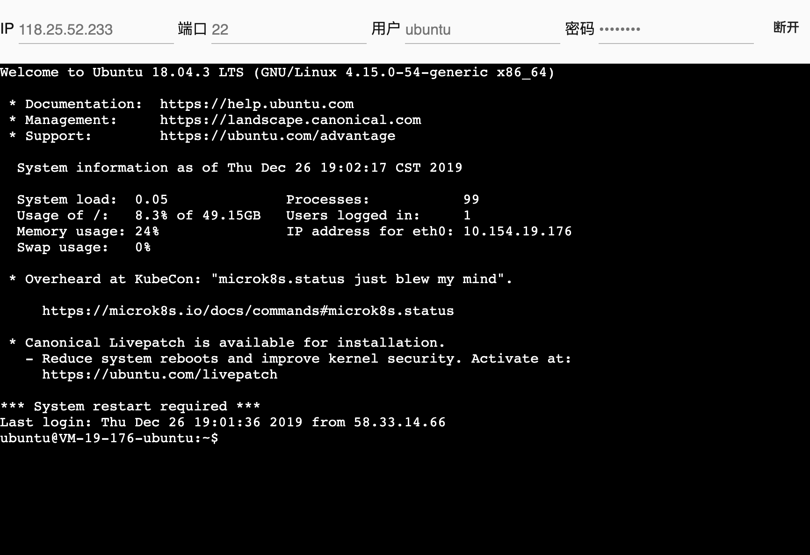

# vissssa-webssh
> 一个简易的webssh，可以满足我临时连接我的服务器

WIP正在优化改进中，可能会做成一个平台来使用

## Install
```bash
git clone https://github.com/vissssa/vissssa-webssh.git
pip install -r requirement.txt
```

## Usage
```bash
python main.py
```
浏览器打开[localhost:9040](http://localhost:9040)即可


## Contributing

PRs accepted.

## License

[MIT © vissssa](./LICENSE)